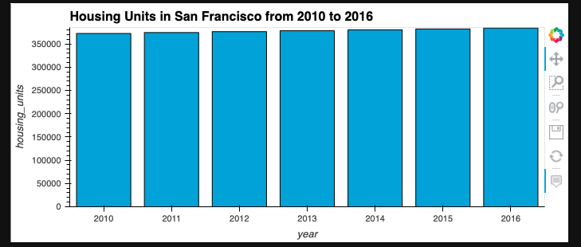
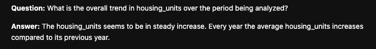
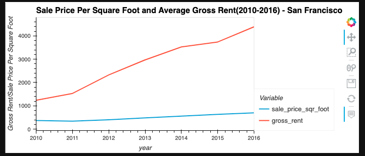
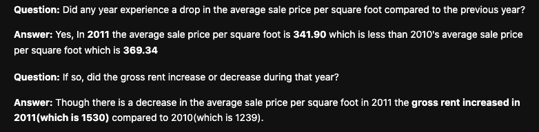
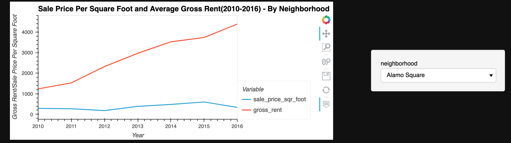
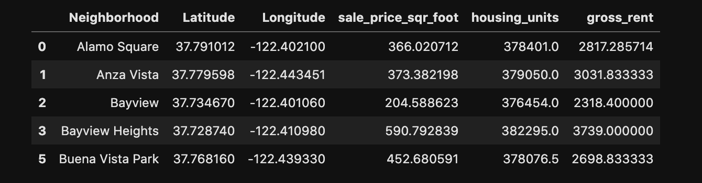
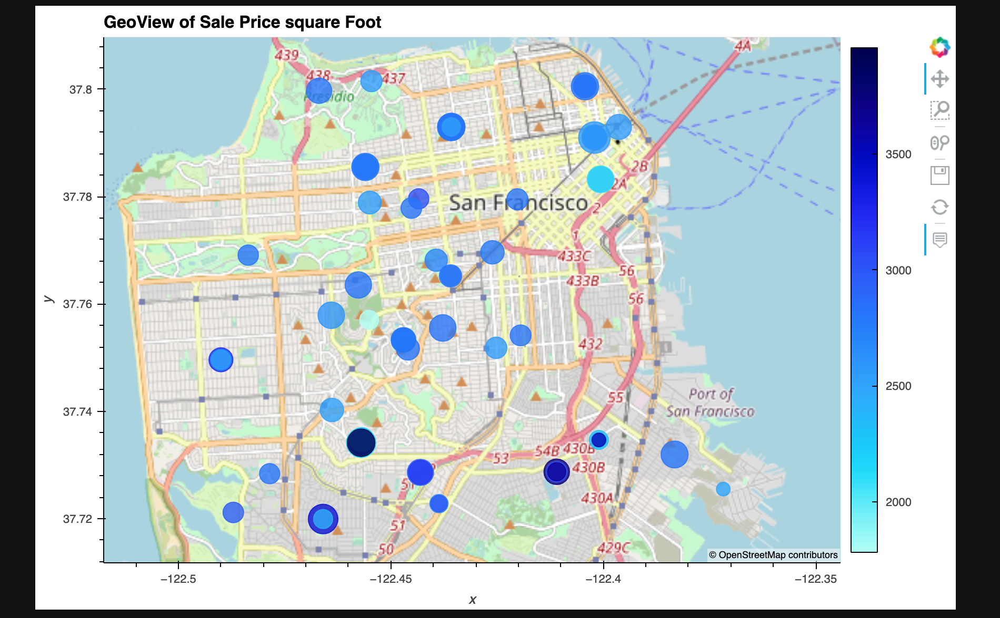
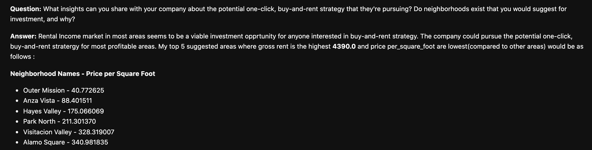

# SFO_Rental_Market_Analysis
   This data visualization application analysis the housing rental market data in San Francisco area and helps the user to find properties that are viable investment for them. 
    
---

## Technologies

This application works on python 3.7 and uses following libraries:

* [hvplot](https://pyviz-dev.github.io/hvplot/index.html) - A component of PyViz ecosystem used for creating Interactive Visualizations of data.
* [geoviews](https://github.com/holoviz/geoviews) - A component of PyViz ecosystem used for visualization of geospacial(location-based) data.

---

## Installation Guide

Follow the following instructions before using the application.

```python 
  conda install -c pyviz hvplot geoviews
```
---

### Calculate and plot the housing units per year

 Using numerical and visual aggregation, we calculate the number of housing units per year, and then visualize the results as a bar chart.

   1. Using `groupby` function to group the data by year and the `mean` of the result is calculated.

   2. Using the `hvplot` function to plot the `housing_units_by_year` DataFrame as a bar chart
    
   
    
   
    
---

## Calculate and Plot the Average Sale Prices per Square Foot

Using numerical and visual aggregation, we calculate the average prices per square foot, and then visualize the results as a line plot.

   1. The data is grouped by year using `groupby` function and the `mean` of the result is calculated.

   2. A new dataframe `prices_square_foot_by_year` is created by filtering out the “housing_units” column and including just the averages per year for only the sale price per square foot and the gross rent.

   3. A line plot of the `prices_square_foot_by_year` is plotted using `hvplot` function with `year` in x-axis and both `sale_price_sqr_foot` &  `gross_rent` in y-axis. The plot is then formatted and styled.

   

   
   
---

## Comparison of Average Sale Prices by Neighborhood 

Using interactive visualizations and widgets we explore the average sale price per square foot by neighborhood.

   1. A new Dataframe is created by grouping the original Dataframe by year and neighbourhood.The results are then aggregated by the `mean` of the groups.

   2. A DataFrame that includes only the `sale_price_sqr_foot` and `gross_rent` averages per year is created by filtering out the `housing_units` column.

   3. An interactive line plot with hvPlot is created that visualizes both `sale_price_sqr_foot` and `gross_rent`. It is then styled and formatted.
   
   
    
   
   
---

## Building an Interactive Neighborhood Map

Using hvPlot and GeoViews, we explore the geospatial relationships in the data. We use the `sfo_data_df` DataFrame (created during the initial import) to build the map plot, which includes the neighborhood location data with the average prices.

   1. We create a Dataframe `neighborhood_locations_df` by importing the `neighborhood_coordinates.csv` file from the `Resources` folder.

   2. Using the original `sfo_data_df` Dataframe, we create a DataFrame named `all_neighborhood_info_df` by grouping the data by neighborhood and aggregating the results by the `mean` of the group.

   3. A new DataFrame `all_neighborhoods_df` is created by concatenating `neighborhood_locations_df` DataFrame with `all_neighborhood_info_df` DataFrame.
   
   

   4. We create a `points` plot for `all_neighborhoods_df` DataFrame using hvPlot with GeoViews enabled. We set the parameters of the plots as follows:

    * The `geo` parameter to True.

    * The `size` parameter to “sale_price_sqr_foot”.

    * The `color` parameter to “gross_rent”.

    * The `frame_width` parameter as 700.
    
    * The `frame_height` parameter as 500.

   
   
   
   
---

## Data Story

   
   
   
   